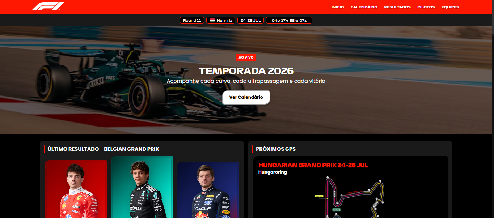
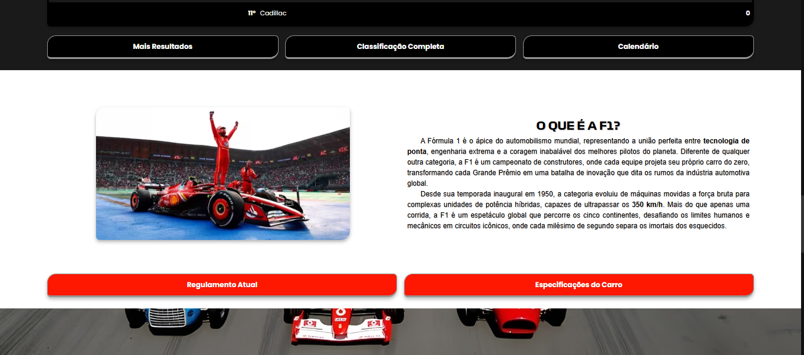
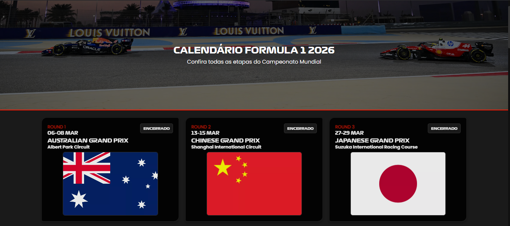
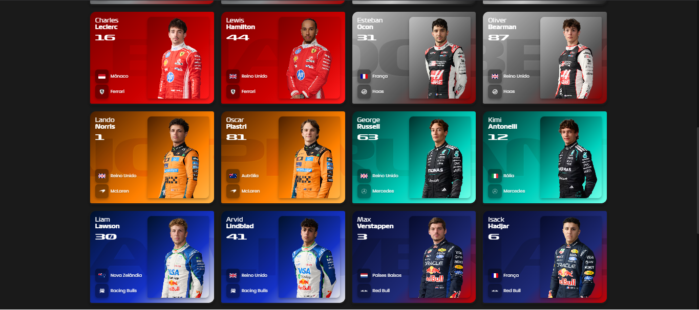
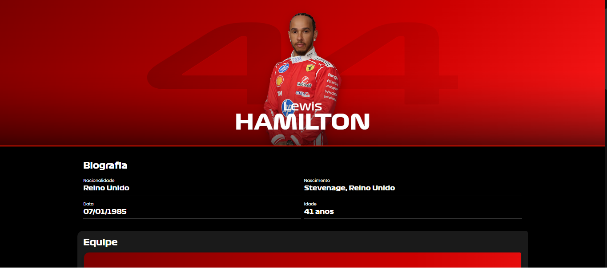
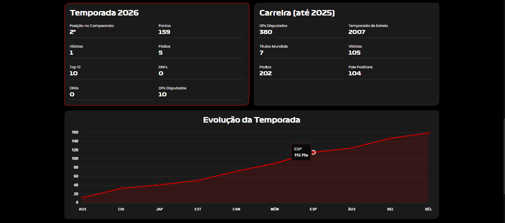
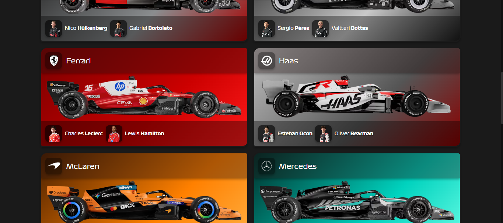
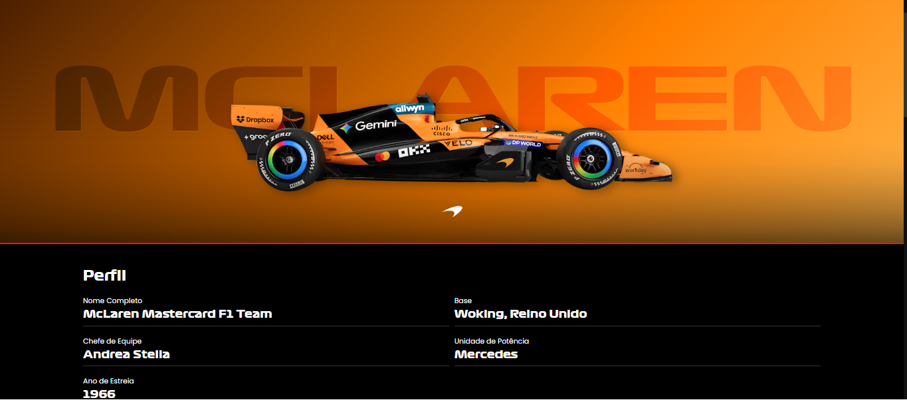
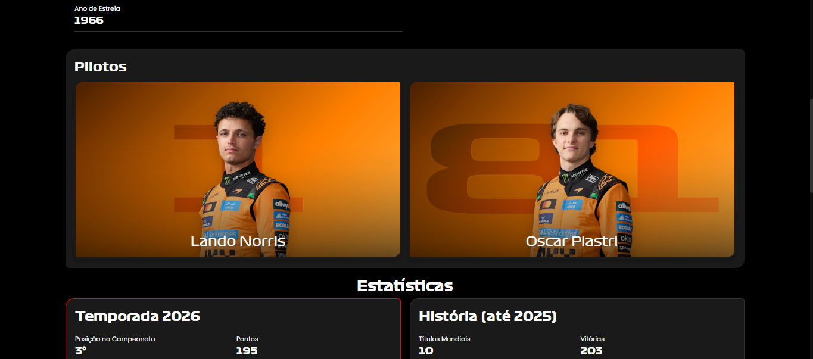
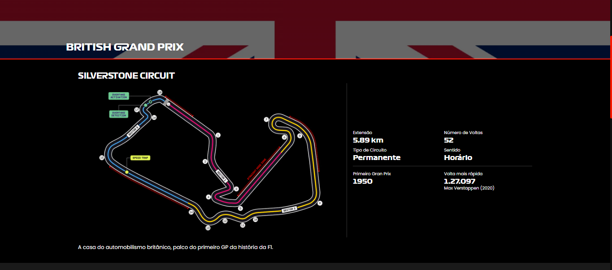

# 🏁 Portal Formula 1 F1 Info

> Website moderno, responsivo e dinâmico sobre o universo da Fórmula 1.

## 📌 Sobre o Projeto

Este projeto apresenta informações completas sobre o universo da Fórmula 1, unindo um design moderno com consumo de dados dinâmicos. A proposta foi construir uma experiência acessível e fluida para os fãs do esporte, destacando o uso de HTML e CSS para a estrutura/design, além de JavaScript para interação e renderização.

O portal inclui:
* **📅 Calendário:** Próximos eventos e informações históricas de circuitos.
* **🏆 Classificação:** Resultados atualizados de pilotos e escuderias.
* **🏎️ Imersão:** Páginas dedicadas a detalhes de pilotos e equipes.
* **💾 Dados:** Conteúdo dinâmico carregado a partir de arquivos JSON locais.

## 📸 Screenshots

### Tela inicial


### Tela sobre


### Tela de calendário


### Tela de pilotos


### Tela de perfil de piloto


### Gráfico de evolução do piloto


### Tela de equipes


### Tela de perfil de equipe


### Tela de perfil de equipe com pilotos


### Tela de circuito


---

## 🛠️ Tecnologias Utilizadas

Para o desenvolvimento deste ecossistema front-end, foram utilizadas as seguintes tecnologias:


---

## 🚀 Funcionalidades

* **Home Dinâmica:** Destaque instantâneo para os próximos GPs da temporada.
* **Navegação Modular:** Páginas exclusivas para calendário, pilotos, equipes e circuitos.
* **Layout Fluido:** Design totalmente adaptado e responsivo para qualquer tamanho de tela (Mobile/Desktop).
* **JS Estruturado:** Arquitetura baseada em *ES Modules* para garantir manutenção simples e escalabilidade.

---

## 📂 Estrutura de Arquivos

```text
├── index.html          # Página inicial do portal
├── schedule.html       # Calendário de corridas e resultados
├── drivers.html        # Grid completo de pilotos da temporada
├── driver.html         # Detalhes e histórico dos pilotos
├── teams.html          # Lista e histórico das escuderias
├── team.html           # Detalhes e histórico das escuderias
├── circuit.html        # Detalhes técnicos dos circuitos
├── data/               # Arquivos JSON (Banco de dados local)
├── styles/             # Arquitetura de arquivos CSS
└── js/                 # Lógica de renderização e ES Modules
```

---

## 💻 Como Executar Localmente

### Pré-requisitos
Antes de começar, você vai precisar ter o [Git](https://git-scm.com) instalado em sua máquina. Se optar pelo método do Python, certifique-se de ter o Python 3 instalado.

```bash
# 1. Clone este repositório
\$ git clone https://github.com/luanfeliper/Portal-Formula-1-F1-Info.git

# 2. Acesse a pasta do projeto
\$ cd Portal-Formula-1-F1-Info

# 3. Inicialize um servidor local (Escolha uma das opções abaixo)

# Opção A: Usando Python
\$ python -m http.server 8000

# Opção B: Usando a extensão Live Server do VS Code
# Basta clicar em "Go Live" no canto inferior direito do editor.

# 4. O site abrirá na porta indicada (Geralmente http://localhost:8000)
```

---

## 🔮 Melhorias Futuras

* [ ] Adicionar micro-interações, transições de página e animações com CSS/JS.
* [ ] Implementar sistema de busca global e filtros dinâmicos por temporada/piloto.

---

## 👤 Autor

Desenvolvido com 🏎️ por **Luan Felipe** 